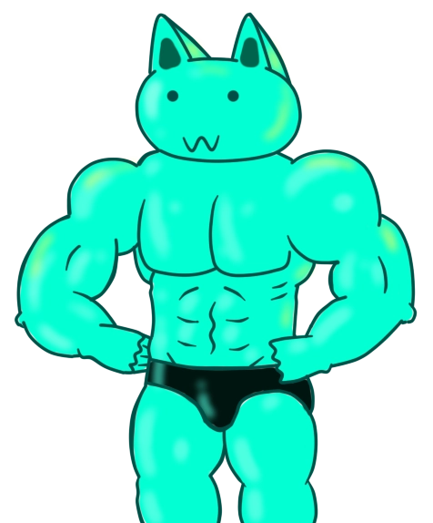

## Hello there! ( ͡° ͜ʖ ͡°)

Im a uni student, coursing a Bachelor's degree in Computer Science & Engineering.

I enjoy spending my free time playing video games && also ( learning || testing ) different technologies :D. Im currently learning about blockchain, more specifically Ethereum's blockchain with Solidity.

This is my github repo, and you will find personal stuff and uni related projects.
- 
- 
- 📖 Currently studying at [UA][uni]!
- 📜 Here is [my resume][website] and [portfolio][portfolio].
- 🎮 Creator of the [OldBox Community][ob]!
- 📚 My favorite author is Dmitri Glujovski.
- 
- 🎵 <i><a href="https://www.youtube.com/watch?v=6e9-DndY-4s">Bucovina, plai cu flori Unde sunt ai tai feciori, Au fost dusi in alta tara, Dar se-ntorc la primavara</a>.</i>

### Lets get in touch!

### And if you came from AlliedModders, you must be here for these!

    
    
    
    

[uni]: https://www.ua.es/en/index.html
[website]: https://frenzoid.github.io/Frenzoid/
[portfolio]: https://frenzoid.github.io/Frenzoid/portfolio.html
[ob]: https://oldbox.cloud/
